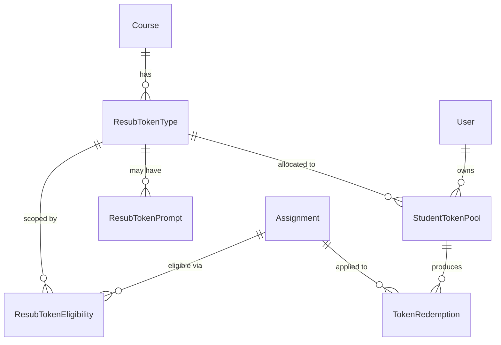

# Resubmission Token Data Model

**\*Note**: The current data model uses "Pass" (without a PassType enum) for the naming instead of "Token" (clashes with the existing table used for email verification and password reset tokens) or "ResubToken" (as shown below). This info describes the basic modeling strategy in decent detail, however, and is still useful for understanding the basic model entities and relationships.\*

This document describes the Prisma schema additions required to support resubmission tokens (a.k.a. "free passes" / "timebank days").

---

## Overview

The model is composed of five new tables:

| Model                    | Purpose                                                                         |
| ------------------------ | ------------------------------------------------------------------------------- |
| **TokenType**            | Teacher-defined template: name, policy rules, initial balance                   |
| **TokenTypeEligibility** | Which assignments (or assignment patterns) a token type may be used on          |
| **TokenTypePrompt**      | Supplemental choices a student must make when redeeming (e.g., date/time slots) |
| **StudentTokenPool**     | Per-student balance for each token type in a course                             |
| **TokenRedemption**      | Receipt recording each use of a token                                           |



---

## Enums

```prisma
/// What actions a token authorises.
enum ResubTokenUsage {
  EXTEND      // Can only extend an existing deadline
  REOPEN      // Can only reopen/retry a past-due assignment
  BOTH        // Either action
}
```

---

## Models

### `ResubTokenType`

Teacher-defined token template, scoped to a single course.

```prisma
model ResubTokenType {
  id              String           @id @default(uuid())
  courseId         String
  course           Course           @relation(fields: [courseId], references: [id], onDelete: Cascade)

  name             String           // e.g. "Quiz Retry Pass", "Late Day"
  description      String?          // Optional teacher-facing note

  // ── Policy ──────────────────────────────────────────
  usage            ResubTokenUsage  @default(BOTH)
  initialBalance   Int              @default(1)   // Tokens each student starts with
  allowRequests    Boolean          @default(false) // Can a student request more?
  hoursPerToken    Int              @default(24)  // Hours of extension each token buys

  // ── Temporal eligibility guard ──────────────────────
  /// Max days in the past an assignment's due date can be
  /// for this token to apply (null = no limit).
  maxDaysPastDue   Int?

  createdAt        DateTime         @default(now())
  updatedAt        DateTime         @updatedAt

  // Relations
  eligibilities    ResubTokenEligibility[]
  prompts          ResubTokenPrompt[]
  pools            StudentTokenPool[]

  @@index([courseId])
}
```

**Design notes**

- `initialBalance` is the number of tokens every student receives by default when their pool is provisioned.
- `allowRequests` governs whether the UI should surface a "Request additional token" action.
- `hoursPerToken` defines how much extension time one token buys. Application logic divides the requested extension by this value (rounding up) to compute the cost. For example, with `hoursPerToken = 24`, a student redeeming on day 2 past the deadline pays ⌈48 / 24⌉ = **2 tokens**.
- `maxDaysPastDue` provides a simple temporal guard without requiring per-assignment rows in the eligibility table.

---

### `ResubTokenEligibility`

Defines _which_ assignments a token type can be used on. A token type with **no eligibility rows** is usable on _all_ assignments in the course (subject to `maxDaysPastDue`). Adding rows restricts usage to only those matching assignments.

```prisma
model ResubTokenEligibility {
  id              String          @id @default(uuid())
  tokenTypeId     String
  tokenType       ResubTokenType  @relation(fields: [tokenTypeId], references: [id], onDelete: Cascade)

  // ── Option A: Direct assignment reference ──
  assignmentId    String?
  assignment      Assignment?     @relation(fields: [assignmentId], references: [id], onDelete: Cascade)

  // ── Option B: Pattern-based matching ──
  titlePattern    String?         // SQL LIKE / ILIKE pattern against Assignment.title
                                  // e.g. "Quiz%" or "%Homework%"

  createdAt       DateTime        @default(now())

  @@index([tokenTypeId])
}
```

**How eligibility is evaluated (application logic)**

1. If zero `ResubTokenEligibility` rows exist → the token type applies to _every_ assignment.
2. Otherwise, an assignment is eligible if **any** eligibility row matches:
   - `assignmentId` equals the assignment's id, **OR**
   - `titlePattern` matches the assignment's title (case-insensitive LIKE).
3. On top of row-level matching, `maxDaysPastDue` (from `ResubTokenType`) is always enforced.

---

### `ResubTokenPrompt`

Some token types require the student to choose supplemental information at redemption time (e.g., select a make-up date/time for a quiz).

```prisma
model ResubTokenPrompt {
  id            String          @id @default(uuid())
  tokenTypeId   String
  tokenType     ResubTokenType  @relation(fields: [tokenTypeId], references: [id], onDelete: Cascade)

  label         String          // Prompt label shown to student, e.g. "Choose a make-up date"
  choicesJson   Json            // Array of allowed values, e.g. ["2026-02-15T10:00", "2026-02-17T14:00"]

  sortOrder     Int             @default(0)
  createdAt     DateTime        @default(now())

  @@index([tokenTypeId])
}
```

**Design notes**

- `choicesJson` is a `Json` column holding an array of strings. This keeps the schema simple while supporting arbitrarily typed options.
- Multiple prompts can exist per token type (e.g., pick a date _and_ pick a room), ordered by `sortOrder`.
- The student's chosen values are stored in `TokenRedemption.promptResponsesJson`.

---

### `StudentTokenPool`

Tracks how many tokens of a given type each student currently has.

```prisma
model StudentTokenPool {
  id            String          @id @default(uuid())
  userId        String
  user          User            @relation(fields: [userId], references: [id], onDelete: Cascade)
  tokenTypeId   String
  tokenType     ResubTokenType  @relation(fields: [tokenTypeId], references: [id], onDelete: Cascade)

  balance       Int             // Current remaining tokens

  createdAt     DateTime        @default(now())
  updatedAt     DateTime        @updatedAt

  // Relations
  redemptions   TokenRedemption[]

  @@unique([userId, tokenTypeId])
}
```

**Provisioning strategy (application logic)**

Pools are lazily created the first time a student views their tokens for a token type. The initial `balance` is copied from `ResubTokenType.initialBalance`. This avoids bulk-creating rows when a token type is defined.

---

### `TokenRedemption`

Receipt created each time a student spends a token.

```prisma
model TokenRedemption {
  id              String            @id @default(uuid())
  poolId          String
  pool            StudentTokenPool  @relation(fields: [poolId], references: [id], onDelete: Cascade)

  assignmentId    String
  assignment      Assignment        @relation(fields: [assignmentId], references: [id], onDelete: Cascade)

  // ── What action was taken ───────────────────────────
  usage           ResubTokenUsage   // EXTEND or REOPEN (never BOTH here)
  tokensCost      Int               @default(1) // Number of tokens deducted from the pool

  // ── New deadline window ─────────────────────────────
  availableFrom   DateTime?         // New "available from" time (nullable if unchanged)
  dueAt           DateTime?         // New "due at" time
  acceptUntil     DateTime?         // New "accept until" cutoff

  // ── Prompt responses ────────────────────────────────
  /// JSON object mapping ResubTokenPrompt.id → chosen value.
  /// Null when the token type has no prompts.
  promptResponsesJson Json?

  // ── Audit ───────────────────────────────────────────
  redeemedAt      DateTime          @default(now())

  @@index([poolId])
  @@index([assignmentId])
}
```

---

## Required Relation Additions to Existing Models

The new models reference `Course`, `User`, and `Assignment`. The following back-relation arrays must be added:

```diff
 model User {
   ...
+  tokenPools     StudentTokenPool[]
 }

 model Course {
   ...
+  resubTokenTypes ResubTokenType[]
 }

 model Assignment {
   ...
+  tokenEligibilities ResubTokenEligibility[]
+  tokenRedemptions   TokenRedemption[]
 }
```

---

## Index & Constraint Summary

| Table                   | Indexes / Constraints                          |
| ----------------------- | ---------------------------------------------- |
| `ResubTokenType`        | `@@index([courseId])`                          |
| `ResubTokenEligibility` | `@@index([tokenTypeId])`                       |
| `ResubTokenPrompt`      | `@@index([tokenTypeId])`                       |
| `StudentTokenPool`      | `@@unique([userId, tokenTypeId])`              |
| `TokenRedemption`       | `@@index([poolId])`, `@@index([assignmentId])` |

---

## Example Scenarios

### 1. "Late Day" token (extend deadline, variable cost)

- **ResubTokenType**: `usage = EXTEND`, `initialBalance = 5`, `hoursPerToken = 24`, `allowRequests = false`, no eligibility rows, `maxDaysPastDue = null`.
- **StudentTokenPool**: Each student gets a pool with `balance = 5`.
- **Redemption on day 1**: `tokensCost = 1`, `dueAt` shifted by +24 h.
- **Redemption on day 2**: `tokensCost = 2`, `dueAt` shifted by +48 h. Student's remaining balance drops by 2.

### 2. "Quiz Retry Pass" (reopen specific quizzes with date selection)

- **ResubTokenType**: `usage = REOPEN`, `initialBalance = 1`, `allowRequests = true`, `maxDaysPastDue = 14`.
- **ResubTokenEligibility**: One row per quiz assignment, or a single row with `titlePattern = 'Quiz%'`.
- **ResubTokenPrompt**: `label = "Choose a make-up date"`, `choicesJson = ["2026-02-15T10:00", "2026-02-17T14:00"]`.
- **TokenRedemption**: Records the chosen make-up date in `promptResponsesJson`, plus new `availableFrom` / `dueAt` / `acceptUntil`.

### 3. "Free Pass" (extend or reopen recent assignments)

- **ResubTokenType**: `usage = BOTH`, `initialBalance = 2`, `allowRequests = false`, no eligibility rows, `maxDaysPastDue = 7`.
- **TokenRedemption**: `usage` is set to whichever action the student selected at redemption time.
